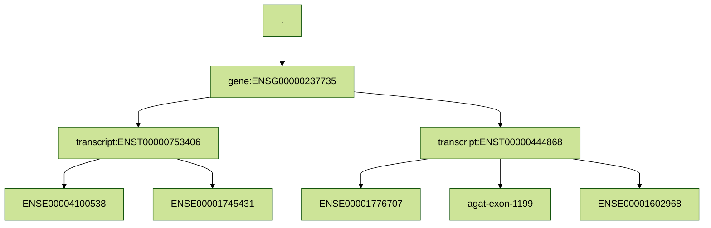

# RAIN - RNA Alterations Investigation using Nextflow

RAIN is a Nextflow workflow designed for epitranscriptomic analyses, enabling the detection of RNA modifications in comparison to a reference genome.
Its primary goal is to distinguish true RNA editing events from genomic variants such as SNPs, with a particular emphasis on identifying A-to-I (Adenosine-to-Inosine) editing.

 

## Table of Contents

- [RAIN - RNA Alterations Investigation using Nextflow](#rain---rna-alterations-investigation-using-nextflow)
  - [Table of Contents](#table-of-contents)
  - [Foreword](#foreword)
  - [Flowchart](#flowchart)
  - [Installation](#installation)
    - [Nextflow](#nextflow)
    - [Container platform](#container-platform)
    - [Docker](#docker)
    - [Singularity](#singularity)
  - [Usage](#usage)
    - [Help](#help)
    - [Profile](#profile)
    - [Test](#test)
  - [Parameters](#parameters)
  - [Output](#output)
    - [Feature file](#feature-file)
  - [Aggregate file](#aggregate-file)
    - [Aggregation modes](#aggregation-modes)
    - [Genome and chromosome/contig aggregates](#genome-and-chromosomecontig-aggregates)
  - [Computing editing levels from the base pairing lists](#computing-editing-levels-from-the-base-pairing-lists)
  - [Author and contributors](#author-and-contributors)
  - [Contributing](#contributing)


## Foreword

...

## Flowchart

...

## Installation

The prerequisites to run the pipeline are:  

  * [Nextflow](https://www.nextflow.io/)  >= 22.04.0
  * [Docker](https://www.docker.com) or [Singularity](https://sylabs.io/singularity/)  

### Nextflow 

  * Via conda 

    <details>
      <summary>See here</summary>
      
      ```bash
      conda create -n nextflow
      conda activate nextflow
      conda install bioconda::nextflow
      ```  
    </details>

  * Manually
    <details>
      <summary>See here</summary>
      Nextflow runs on most POSIX systems (Linux, macOS, etc) and can typically be installed by running these commands:

      ```bash
      # Make sure 11 or later is installed on your computer by using the command:
      java -version
      
      # Install Nextflow by entering this command in your terminal(it creates a file nextflow in the current dir):
      curl -s https://get.nextflow.io | bash 
      
      # Add Nextflow binary to your user's PATH:
      mv nextflow ~/bin/
      # OR system-wide installation:
      # sudo mv nextflow /usr/local/bin
      ```
    </details>

### Container platform

To run the workflow you will need a container platform: docker or singularity.

### Docker

Please follow the instructions at the [Docker website](https://docs.docker.com/desktop/)

### Singularity

Please follow the instructions at the [Singularity website](https://docs.sylabs.io/guides/latest/admin-guide/installation.html)

## Usage

### Help

You can first check the available options and parameters by running:

```bash
nextflow run Juke34/RAIN -r v1.5.0 --help
```

### Profile

To run the workflow you must select a profile according to the container platform you want to use:   
- `singularity`, a profile using Singularity to run the containers
- `docker`, a profile using Docker to run the containers

The command will look like that: 

```bash
nextflow run Juke34/RAIN -r vX.X.X -profile docker <rest of paramaters>
```

Another profile is available (/!\\ actually not yet implemented):

- `slurm`, to add if your system has a slurm executor (local by default) 

The use of the `slurm` profile  will give a command like this one:

```bash
nextflow run Juke34/RAIN -r vX.X.X -profile singularity,slurm <rest of paramaters>
```

### Test

With nextflow and docker available you can run (where vX.X.X is the release version you wish to use):

```bash
nextflow run -profile docker,test Juke34/RAIN -r vX.X.X
```

Or via a clone of the repository: 

```
git clone https://github.com/Juke34/rain.git
cd rain
nextflow run -profile docker,test rain.nf
```

## Parameters

```
RAIN - RNA Alterations Investigation using Nextflow - v0.1

        Usage example:
    nextflow run rain.nf -profile docker --genome /path/to/genome.fa --annotation /path/to/annotation.gff3 --reads /path/to/reads_folder --output /path/to/output --aligner hisat2

        Parameters:
    --help                      Prints the help section

        Input sequences:
    --annotation                Path to the annotation file (GFF or GTF)
    --reads                     path to the reads file, folder or csv. If a folder is provided, all the files with proper extension in the folder will be used. You can provide remote files (commma separated list).
                                    file extension expected : <.fastq.gz>, <.fq.gz>, <.fastq>, <.fq> or <.bam>. 
                                                              for paired reads extra <_R1_001> or <_R2_001> is expected where <R> and <_001> are optional. e.g. <sample_id_1.fastq.gz>, <sample_id_R1.fastq.gz>, <sample_id_R1_001.fastq.gz>)
                                    csv input expects 6 columns: sample, fastq_1, fastq_2, strandedness and read_type. 
                                    fastq_2 is optional and can be empty. Strandedness, read_type expects same values as corresponding RAIN parameter; If a value is provided via RAIN paramter, it will override the value in the csv file.
                                    Example of csv file:
                                        sample,fastq_1,fastq_2,strandedness,read_type
                                        control1,path/to/data1.fastq.bam,,auto,short_single
                                        control2,path/to/data2_R1.fastq.gz,path/to/data2_R2.fastq.gz,auto,short_paired
    --genome                    Path to the reference genome in FASTA format.
    --read_type                 Type of reads among this list [short_paired, short_single, pacbio, ont] (no default)

        Output:
    --output                    Path to the output directory (default: result)

       Optional input:
    --aligner                   Aligner to use [default: hisat2]
    --edit_site_tool            Tool used for detecting edited sites. Default: reditools3
    --strandedness              Set the strandedness for all your input reads (default: null). In auto mode salmon will guess the library type for each fastq sample. [ 'U', 'IU', 'MU', 'OU', 'ISF', 'ISR', 'MSF', 'MSR', 'OSF', 'OSR', 'auto' ]
    --edit_threshold            Minimal number of edited reads to count a site as edited (default: 1)
    --aggregation_mode          Mode for aggregating edition counts mapped on genomic features. See documentation for details. Options are: "all" (default) or "cds_longest"
    --clipoverlap               Clip overlapping sequences in read pairs to avoid double counting. (default: false)

        Nextflow options:
    -profile                    Change the profile of nextflow both the engine and executor more details on github README [debug, test, itrop, singularity, local, docker]
```

## Output

Here the description of typical ouput you will get from RAIN:  

```
└── rain_results                                         # Output folder set using --outdir. Default: <alignment_results>
    │
    ├── AliNe                                            # Folder containing AliNe alignment pipeline result (see https://github.com/Juke34/AliNe)
    │   ├── alignment                                    # bam alignment used by RAIN
    │   ├── salmon_strandedness                          # strandedness collected by AliNe in case auto mode was in used for fastq files
    │   └── ...      
    │
    ├── bam_indicies                                     # bam and indices bam.bai
    │
    ├── FastQC                                           # bam and indices bam.bai
    │
    ├── gatk_markduplicates                              # metrics and bam after markduplicates
    │
    └── Reditools2/Reditools3/Jacusa/sapin/              # Editing output from corresponding tool
    │
    └── feature_edits                                    # Editing computed at different level (genomic features, chromosome, global)
```

<details>
<summary>More details about the output format</summary>
Pluviometer produces an output file for features (features.tsv) and another for aggregates (aggregates.tsv), plus a log file called pluviometer.log. The `--output` option can be used to add prefixes to the file names.

The two output formats are tables of comma-separated values with a header.

### Feature file

| Column Name      | Values or type                    | Description                                                                                                                                                |
| ---------------- | --------------------------------- | ---------------------------------------------------------------------------------------------------------------------------------------------------------- |
| SeqID            | String                            | Identifier for contigs or chromosomes, as given in the GFF file                                                                                            |
| ParentIDs        | Comma-separated feature IDs and `.`       | Path of parent features (`.` represents the "root" of the path, corresponding to the contig or chromosome itself)                                                                                                                                    |
| FeatureID        | String                            | Feature ID from the GFF file                                                                                                                               |
| Type             | String                            | Feature type from the GFF file                                                                                                                             |
| Start            | Positive integer                  | Starting position of the feature (inclusive)                                                                                                               |
| End              | Positive integer                  | Ending position of the feature (inclusive)                                                                                                                 |
| Strand           | `1` or `-1`                       | Whether the features is located on the positive (5'->3') or negative (3'->5') strand                                                                       |
| CoveredSites     | Positive integer                  | Number of sites in the feature that satisfy the minimum level of coverage                                                                                  |
| GenomeBases      | Comma-separated positive integers | Frequencies of the bases in the feature in the reference genome (order: A, C, G, T)                                                                        |
| SiteBasePairings | Comma-separated positive integers | Number of sites in which each genome-variant base pairings is found in the feature (order: AA, AC, AG, AT, CA, CC, CG, CT, GA, GC, GG, GT, TA, TC, TG, TT) |
| ReadBasePairings | Comma-separated positive integers | Frequencies of genome-variant base pairings in the feature  (order: AA, AC, AG, AT, CA, CC, CG, CT, GA, GC, GG, GT, TA, TC, TG, TT)                        |

> [!note]
> The number of **CoveredSites** can be higher than the sum of **SiteBasePairings** because of the presence of ambiguous bases (e.g. N)

An example of the feature output format is shown below, with some alterations to make the text line up in columns.

```txt
SeqID  ParentIDs                                         FeatureID                   Type                    Start   End     Strand  CoveredSites  GenomeBases              SiteBasePairings                                                         ReadBasePairings
21  .                                                  gene:ENSG00000237735        ncRNA_gene              692123  815688  -1            123448  38320,21652,22461,41015  38198,220,216,238,141,21557,136,126,134,151,22379,157,258,831,230,40857  275468,867,820,942,564,156616,577,481,543,606,162232,564,1056,2074,948,296797
21  .,gene:ENSG00000237735                             transcript:ENST00000753406  lnc_RNA                 692123  755798  -1             63595  20528,11342,11596,20129  20458,118,123,138,70,11298,67,71,72,77,11550,75,134,409,121,20044        146979,496,459,541,263,82312,258,262,297,321,83658,264,579,1059,519,145598
21  .,gene:ENSG00000237735,transcript:ENST00000753406  ENSE00004100538             exon                    692123  692253  -1               131  38,20,25,48              38,0,0,0,0,20,2,0,0,0,25,0,0,1,0,48                                      280,0,0,0,0,134,7,0,0,0,165,0,0,4,0,360
21  .,gene:ENSG00000237735,transcript:ENST00000753406  ENSE00001745431             exon                    755680  755798  -1               119  20,37,29,33              20,1,0,0,0,37,0,0,0,1,29,0,0,0,0,33                                      132,4,0,0,0,269,0,0,0,4,216,0,0,0,0,252
21  .,gene:ENSG00000237735                             transcript:ENST00000444868  lnc_RNA                 754519  815688  -1             61133  18166,10572,11104,21291  18114,103,94,101,72,10519,72,56,62,75,11068,84,126,430,109,21217         131936,375,362,403,310,76638,335,225,246,289,80760,308,483,1043,429,154705
21  .,gene:ENSG00000237735,transcript:ENST00000444868  ENSE00001776707             exon                    754519  754770  -1               252  96,41,45,70              96,0,0,0,0,41,1,0,0,0,45,0,0,1,0,70                                      830,0,0,0,0,357,5,0,0,0,410,0,0,1,0,573
21  .,gene:ENSG00000237735,transcript:ENST00000444868  agat-exon-1199              exon                    755680  755798  -1               119  20,37,29,33              20,1,0,0,0,37,0,0,0,1,29,0,0,0,0,33                                      132,4,0,0,0,269,0,0,0,4,216,0,0,0,0,252
21  .,gene:ENSG00000237735,transcript:ENST00000444868  ENSE00001602968             exon                    815622  815688  -1                67  31,10,17,9               31,0,0,0,0,10,0,0,0,1,17,0,0,0,0,9                                       357,0,0,0,0,122,0,0,0,8,199,0,0,0,0,108

```

> [!warning]
> The numbers in the output format examples shown here are just for demonstration. They do not come from empirical data.

The hierarchical relationships between features can be recovered from the fields in the **ParentIDs** column. The output snippet above matches the following hierarchy (recall that `.` represents the "root", i.e. the chromosome or contig).



This hierarchical information is provided in the same manner in the aggregate file format.

## Aggregate file

| Column Name      | Values or type                                               | Description                                                                                                                                                            |
| ---------------- | ------------------------------------------------------------ | ---------------------------------------------------------------------------------------------------------------------------------------------------------------------- |
| SeqID            | String                                                       | Identifier for contigs or chromosomes, as given in the GFF file                                                                                                        |
| ParentIDs        | Comma-separated feature IDs                                  | Path of parent features                                                                                                                                                |
| AggregateID        | String                                                       | ID assigned after the feature under which the aggregation was done                                                                                                                 |
| ParentType       | String                                                       | Type of the parent of the feature under which the aggregation was done                                                                                                 |
| AggregateType    | String                                                       | Type of the features that are aggregated                                                                                                                               |
| AggregationMode  | `all_isoforms`, `longest_isoform`, `chimaera`, `feature` or `all-sites` | Way in which the aggregation was performed                                                                                                                             |
| CoveredSites     | Positive integer                                             | Number of sites in the aggregated features that satisfy the minimum level of coverage                                                                                  |
| GenomeBases      | Comma-separated positive integers                            | Frequencies of the bases in the aggregated features in the reference genome (order: A, C, G, T)                                                                        |
| SiteBasePairings | Comma-separated positive integers                            | Number of sites in which each genome-variant base pairings is found in the aggregated features (order: AA, AC, AG, AT, CA, CC, CG, CT, GA, GC, GG, GT, TA, TC, TG, TT) |
| ReadBasePairings | Comma-separated positive integers                            | Frequencies of genome-variant base pairings in the aggregated features  (order: AA, AC, AG, AT, CA, CC, CG, CT, GA, GC, GG, GT, TA, TC, TG, TT)                        |

In the output of Pluviometer, **aggregation** is the sum of counts from several features of the same type at some feature level. For instance, exons can be aggregated at transcript level, gene level, chromosome level, and genome level.

An example of the aggregate output format is shown below.

````
SeqID  ParentIDs               AggregateID                                 ParentType  AggregateType  AggregationMode  CoveredSites  GenomeBases                  SiteBasePairings                                                                         ReadBasePairings
21     .,gene:ENSG00000237735  transcript:ENST00000444868-longest_isoform  ncRNA_gene  exon           longest_isoform           438  147,88,91,112                147,1,0,0,0,88,1,0,0,2,91,0,0,1,0,112                                                    1319,4,0,0,0,748,5,0,0,12,825,0,0,1,0,933
21     .,gene:ENSG00000237735  gene:ENSG00000237735-all_isoforms           ncRNA_gene  exon           all_isoforms              688  205,145,145,193              205,2,0,0,0,145,3,0,0,3,145,0,0,2,0,193                                                  1731,8,0,0,0,1151,12,0,0,16,1206,0,0,5,0,1545
21     .,gene:ENSG00000237735  transcript:ENST00000753406                  ncRNA_gene  exon           feature                   250  58,57,54,81                  58,1,0,0,0,57,2,0,0,1,54,0,0,1,0,81                                                      412,4,0,0,0,403,7,0,0,4,381,0,0,4,0,612
21     .,gene:ENSG00000237735  transcript:ENST00000444868                  ncRNA_gene  exon           feature                   438  147,88,91,112                147,1,0,0,0,88,1,0,0,2,91,0,0,1,0,112                                                    1319,4,0,0,0,748,5,0,0,12,825,0,0,1,0,933
21     .,gene:ENSG00000237735  gene:ENSG00000237735-exon-chimaera          ncRNA_gene  exon-chimaera  chimaera                  569  185,108,116,160              185,1,0,0,0,108,3,0,0,2,116,0,0,2,0,160                                                  1599,4,0,0,0,882,12,0,0,12,990,0,0,5,0,1293
````

### Aggregation modes

The existence of alternative transcripts of a same gene causes some complication in determining the most meaningful way of aggregating features, because exons of different transcripts can have overlapping ranges. To handle this difficulty, Pluviometer reports three types of aggregation, shown with an example in the figure below.

1. **Longest isoform** (*Transcript 1* in the figure): Report the counts only from the transcript with the longest CDS or greatest total exon length (CDS are always preferred over exons). Its ID is composed of the feature ID of the longest isoform plus "-longest_isoform"

2. **All isoforms** (*Transcripts 1 to 3* in the figure): Report the sum of the counts from all the isoforms, regardless of counting several times the same site. Its ID is composed of the ID of the gene plus "-all_isoforms".

3. **Chimaera** (*Chimaera* in the figure): Report the counts from the union of feature ranges over all the isoforms. Its ID is composed of the ID of the gene plus "-chimaera". The aggregation types of chimaeras are postfixed with "-chimaera" as well.

4. **Feature**
Standard mode for regular features. Aggregates data from sub-features (children) of a given feature. For example, for an exon or CDS, it aggregates the counts of all its constituent elements.

In the example below, a gene has three transcripts. For the **longest isoform** aggregation, Transcript 1 would be selected, because it has the greatest sum of exon lengths (numbers under the exon boxes). For the **all isoforms** aggregation, all the transcripts (1, 2, and 3) would be used. For **chimaera** aggregation, the aggregation ranges are the union of the ranges of the exons of all the transcripts. Therefore, the total length of the chimaeric features is always equal ot greater than the longest transcript.


Chromosomes and genomes also have an **all sites** aggregation mode that simply counts variants over all the sites ignoring all the other features.

### Genome and chromosome/contig aggregates

Aggregatation follows the same logic for chromosomes/contigs and the entire genome. The main difference is that the aggregates of a chromsosome/contig have a SeqID, but no parent IDs (represented with just a `.`) and no feature IDs (represented with just a `.`). See the example below with aggregates of chromosome 21:

````txt
SeqID	 ParentIDs             	 FeatureID                                 	 ParentType	 AggregateType	 AggregationMode	 CoveredSites	 GenomeBases                	 SiteBasePairings                                                                       	 ReadBasePairings

21   	 .                     	 .                                         	 .         	 exon         	 longest_isoform	         8884	 2874,1621,1613,2776        	 2868,11,20,18,9,1619,8,10,9,10,1608,11,17,52,18,2763                                   	 19234,43,72,58,22,11322,31,40,30,56,11248,49,60,113,108,18070
21   	 .                     	 .                                         	 .         	 exon         	 all_isoforms   	        19064	 5995,3466,3520,6083        	 5980,23,45,39,12,3462,23,16,18,20,3507,28,40,110,37,6055                               	 41820,74,210,146,28,24433,70,50,81,108,25400,147,145,238,207,41714
21   	 .                     	 .                                         	 .         	 exon-chimaera	 chimaera       	        11853	 3742,2228,2188,3695        	 3733,15,26,24,10,2225,14,12,11,11,2181,15,24,65,23,3680                                	 25416,54,108,76,24,15487,48,42,41,62,15398,73,85,136,133,24713
21   	 .                     	 .                                         	 .         	 .            	 all_sites      	       999437	 330327,177650,176540,314920	 329214,1950,1986,1989,1170,177038,1036,1054,1006,1030,175968,1142,1868,6373,1848,313853	 2409166,7937,7754,7884,4656,1297210,4261,4149,4087,4215,1287279,4302,7457,15760,7686,2293932
````

The genome-level aggregates are marked the same way, but because they represent the total of all chromosomes/contigs, the **SeqID** field is just a `.`. Like so:

````txt
SeqID	 ParentIDs             	 FeatureID                                 	 ParentType	 AggregateType	 AggregationMode	 CoveredSites	 GenomeBases                	 SiteBasePairings                                                                       	 ReadBasePairings
.    	 .                     	 .                                         	 .         	 exon         	 longest_isoform	         8884	 2874,1621,1613,2776        	 2868,11,20,18,9,1619,8,10,9,10,1608,11,17,52,18,2763                                   	 19234,43,72,58,22,11322,31,40,30,56,11248,49,60,113,108,18070
.    	 .                     	 .                                         	 .         	 exon         	 all_isoforms   	        19064	 5995,3466,3520,6083        	 5980,23,45,39,12,3462,23,16,18,20,3507,28,40,110,37,6055                               	 41820,74,210,146,28,24433,70,50,81,108,25400,147,145,238,207,41714
.    	 .                     	 .                                         	 .         	 exon-chimaera	 chimaera       	        11853	 3742,2228,2188,3695        	 3733,15,26,24,10,2225,14,12,11,11,2181,15,24,65,23,3680                                	 25416,54,108,76,24,15487,48,42,41,62,15398,73,85,136,133,24713
.    	 .                     	 .                                         	 .         	 .            	 all_sites      	       999437	 330327,177650,176540,314920	 329214,1950,1986,1989,1170,177038,1036,1054,1006,1030,175968,1142,1868,6373,1848,313853	 2409166,7937,7754,7884,4656,1297210,4261,4149,4087,4215,1287279,4302,7457,15760,7686,2293932
````

## Computing editing levels from the base pairing lists

The editing level (Bazak et al. 2014) of a feature or feature aggregate can be easily computed from the **ReadBasePairings** values, with the formula:

$$
AG\ editing\ level = \sum_{i=0}^{n} \dfrac{AG_i}{AA_i + AC_i + AG_i + AT_i}
$$

</details>


## Author and contributors

Eduardo Ascarrunz (@eascarrunz)  
Jacques Dainat  (@Juke34)

## Contributing

Contributions from the community are welcome ! See the [Contributing guidelines](https://github.com/Juke34/rain/blob/main/CONTRIBUTING.md)
