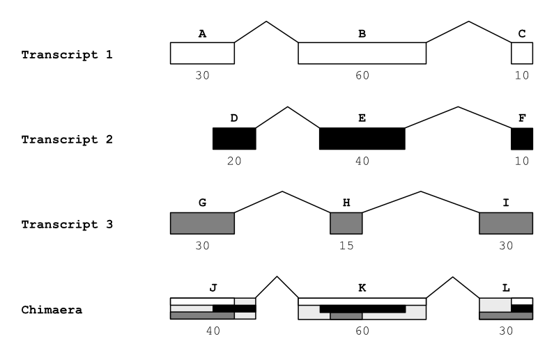

# Pluviometer documentation

Pluviometer is the Python script that quantifies the absolute editing activity at different levels of genome sequence organization. It takes RNA variant calling output files from programs such as Jacusa2 and Reditools, and a GFF3 file with descriptions of genome features.

## Usage

```txt
usage: pluviometer.py [-h] --sites SITES --gff GFF [--output OUTPUT] [--format {reditools2,reditools3,jacusa2,sapin}] [--cov COV]
                      [--edit_threshold EDIT_THRESHOLD] [--aggregation_mode {all,cds_longest}] [-t THREADS] [--progress]

Rain counter

options:
  -h, --help            show this help message and exit
  --sites SITES, -s SITES
                        File containing per-site base alteration data
  --gff GFF, -g GFF     Reference genome annotations (GFF3 file)
  --output OUTPUT, -o OUTPUT
                        Prefix for the names of the output files
  --format {reditools2,reditools3,jacusa2,sapin}, -f {reditools2,reditools3,jacusa2,sapin}
                        Sites file format
  --cov COV, -c COV     Site coverage threshold for counting editions
  --edit_threshold EDIT_THRESHOLD, -T EDIT_THRESHOLD
                        Minimum number of edited reads for counting a site as edited
  -t THREADS, --threads THREADS
                        Number of threads (actually, processes) to use for parallel computing
  --progress            Display progress bar
```

## Output

Pluviometer produces an output file for features (features.tsv) and another for aggregates (aggregates.tsv), plus a log file called pluviometer.log. The `--output` option can be used to add prefixes to the file names.

### Feature file

| Column Name | Values or type | Description |
|-------------|----------------|-------------|
| SeqID | String | Identifier for contigs or chromosomes, as given in the GFF file |
| ParentIDs | Comma-separated feature IDs | Path of parent features |
| FeatureID | String | Feature ID from the GFF file |
| Type | String | Feature type from the GFF file |
| Start | Positive integer | Starting position of the feature (inclusive) |
| End | Positive integer | Ending position of the feature (inclusive) |
| Strand | `1` or `-1` | Whether the features is located on the positive (5'->3') or negative (3'->5') strand |
| CoveredSites | Positive integer | Number of sites in the feature that satisfy the minimum level of coverage |
| GenomeBases | Comma-separated positive integers | Frequencies of the bases in the feature in the reference genome (order: A, C, G, T)|
| SiteBasePairings | Comma-separated positive integers | Number of sites in which each genome-variant base pairings is found in the feature (order: AA, AC, AG, AT, CA, CC, CG, CT, GA, GC, GG, GT, TA, TC, TG, TT) |
| ReadBasePairings | Comma-separated positive integers | Frequencies of genome-variant base pairings in the feature  (order: AA, AC, AG, AT, CA, CC, CG, CT, GA, GC, GG, GT, TA, TC, TG, TT) |

> [!note]
> The number of **CoveredSites** can be higher than the sum of **SiteBasePairings** because of the presence of ambiguous bases (e.g. N)


```txt
SeqID	 ParentIDs                                       	 FeatureID                 	 Type                  	 Start 	 End   	 Strand	 CoveredSites	 GenomeBases            	 SiteBasePairings                                                       	 ReadBasePairings
21	 .                                                	 gene:ENSG00000237735      	 ncRNA_gene            	 692123	 815688	 -1    	       123448	 38320,21652,22461,41015	 38198,220,216,238,141,21557,136,126,134,151,22379,157,258,831,230,40857	 275468,867,820,942,564,156616,577,481,543,606,162232,564,1056,2074,948,296797
21	 .,gene:ENSG00000237735                           	 transcript:ENST00000753406	 lnc_RNA               	 692123	 755798	 -1    	        63595	 20528,11342,11596,20129	 20458,118,123,138,70,11298,67,71,72,77,11550,75,134,409,121,20044      	 146979,496,459,541,263,82312,258,262,297,321,83658,264,579,1059,519,145598
21	 .,gene:ENSG00000237735,transcript:ENST00000753406	 ENSE00004100538           	 exon                  	 692123	 692253	 -1    	          131	 38,20,25,48            	 38,0,0,0,0,20,2,0,0,0,25,0,0,1,0,48                                    	 280,0,0,0,0,134,7,0,0,0,165,0,0,4,0,360
21	 .,gene:ENSG00000237735,transcript:ENST00000753406	 ENSE00001745431           	 exon                  	 755680	 755798	 -1    	          119	 20,37,29,33            	 20,1,0,0,0,37,0,0,0,1,29,0,0,0,0,33                                    	 132,4,0,0,0,269,0,0,0,4,216,0,0,0,0,252
21	 .,gene:ENSG00000237735                           	 transcript:ENST00000444868	 lnc_RNA               	 754519	 815688	 -1    	        61133	 18166,10572,11104,21291	 18114,103,94,101,72,10519,72,56,62,75,11068,84,126,430,109,21217       	 131936,375,362,403,310,76638,335,225,246,289,80760,308,483,1043,429,154705
21	 .,gene:ENSG00000237735,transcript:ENST00000444868	 ENSE00001776707           	 exon                  	 754519	 754770	 -1    	          252	 96,41,45,70            	 96,0,0,0,0,41,1,0,0,0,45,0,0,1,0,70                                    	 830,0,0,0,0,357,5,0,0,0,410,0,0,1,0,573
21	 .,gene:ENSG00000237735,transcript:ENST00000444868	 agat-exon-1199            	 exon                  	 755680	 755798	 -1    	          119	 20,37,29,33            	 20,1,0,0,0,37,0,0,0,1,29,0,0,0,0,33                                    	 132,4,0,0,0,269,0,0,0,4,216,0,0,0,0,252
21	 .,gene:ENSG00000237735,transcript:ENST00000444868	 ENSE00001602968           	 exon                  	 815622	 815688	 -1    	           67	 31,10,17,9             	 31,0,0,0,0,10,0,0,0,1,17,0,0,0,0,9                                     	 357,0,0,0,0,122,0,0,0,8,199,0,0,0,0,108

```

## Aggregate file

| Column Name | Values or type | Description |
|-------------|----------------|-------------|
| SeqID | String | Identifier for contigs or chromosomes, as given in the GFF file |
| ParentIDs | Comma-separated feature IDs | Path of parent features |
| FeatureID | String | ID of the feature under which the aggregation was done |
| ParentType | String | Type of the parent of the feature under which the aggregation was done |
| AggregateType | String | Type of the features that are aggregated |
| AggregationMode | `all_isoforms`, `longest_isoform`, `chimaera` or `all-sites` | Way in which the aggregation was performed |
| CoveredSites | Positive integer | Number of sites in the aggregated features that satisfy the minimum level of coverage |
| GenomeBases | Comma-separated positive integers | Frequencies of the bases in the aggregated features in the reference genome (order: A, C, G, T)|
| SiteBasePairings | Comma-separated positive integers | Number of sites in which each genome-variant base pairings is found in the aggregated features (order: AA, AC, AG, AT, CA, CC, CG, CT, GA, GC, GG, GT, TA, TC, TG, TT) |
| ReadBasePairings | Comma-separated positive integers | Frequencies of genome-variant base pairings in the aggregated features  (order: AA, AC, AG, AT, CA, CC, CG, CT, GA, GC, GG, GT, TA, TC, TG, TT) |

In the output of Pluviometer, **aggregation** is the sum of counts from several features of the same type at some feature level. For instance, exons can be aggregated at transcript level, gene level, chromosome level, and genome level.

The existence of alternative transcripts of a same gene causes some complication in determining the most meaningful way of aggregating features, because exons of different transcripts can have overlapping ranges. To handle this difficulty, Pluviometer reports three types of aggregation, shown with an example in the figure below.

1. **Longest isoform** (*Transcript 1* in the figure): Report the counts only from the transcript with the longest CDS or greatest total exon length (CDS are always preferred over exons)
2. **All isoforms** (*Transcripts 1 to 3* in the figure): Report the sum of the counts from all the isoforms, regardless of counting several times the same site.
3. **Chimaera** (*Chimaera* in the figure): Report the counts from the union of feature ranges over all the isoforms

Chromosomes and genomes also have an **all sites** aggregation mode that simply counts variants over all the sites ignoring all the other features.



### Base lists and base pairing lists

The fields **GenomeBases**, **SiteBasePairings**, and **ReadBasePairings** are common to the feature file and the aggregate file. They contain frequencies of bases (**GenomeBases**) or pairings of genome bases and mapped bases of RNA variants (**SiteBasePairings** and **ReadBasePairings**), encoded as lists of comma-separated integers.

In **GenomeBases**, the base frequencies in the list are reported in the order A, C, G, T. The lists **SiteBasePairings** and **ReadBasePairings** contain 16 values, representing all the possible pairings between a base in the genome and a mapped base in an RNA variant. The pairings are in the following order:

| 1 | 2 | 3 | 4 | 5 | 6 | 7 | 8 | 9 | 10 | 11 | 12 | 13 | 14 | 15 | 16 |
|---|---|---|---|---|---|---|---|---|----|----|----|----|----|----|----|
| AA | AC | AG | AT | CA | CC | CG | CT | GA | GC | GG | GT | TA | TC | TG | TT |

> [!note]
> When writing scripts for post-processing the output of Pluviometer, it can be useful to bear in mind that the indices of the pairings in the list are derived from a matrix where each row represents a base in the genome and each column represents the mapped base of an RNA variant.
> 
> |   | A  | C  | G  | T  |
> |---|----|----|----|----|
> | **A** |  1 |  2 |  3 |  4 |
> | **C** |  5 |  6 |  7 |  8 |
> | **G** |  9 | 10 | 11 | 12 |
> | **T** | 13 | 14 | 15 | 16 |

## Computing editing levels from the base pairing lists

The editing level (Chigaev et al. 2019) of a feature or feature aggregate can be easily computed from the **ReadBasePairings** values, with the formula

$$
AG\ editing\ level = \sum_{i=0}^{n} \dfrac{AG_i}{AA_i + AC_i + AG_i + AT_i}
$$

## Internals

### `RNASiteVariantReader`

This abstract base class defines the API for the subclasses that handle the reading of the different site variant input file formats accepted by Pluviometer.

### 